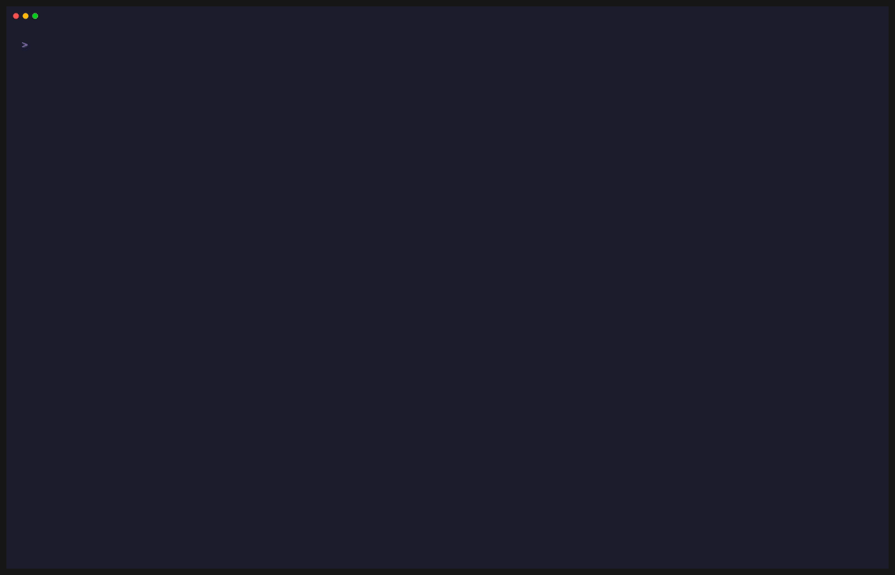
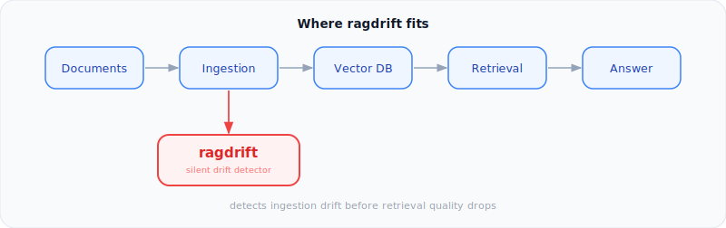
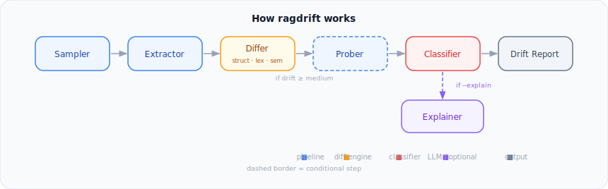

[](https://github.com/crishN144/ragdrift/actions/workflows/ci.yml)
[](https://pypi.org/project/ragdrift/)
[](https://pypi.org/project/ragdrift/)
[](LICENSE)
[](https://arxiv.org/abs/2601.14479)

ragdrift detected an 11.9pp accuracy drop across 6 documents in 0.2 seconds. Your users would have found out in 3 weeks.

RAG systems don't crash, they rot. A changed PDF template, a parser upgrade, a stale index rebuild — and retrieval accuracy quietly falls off a cliff. ragdrift catches it before re-ingestion.

| Metric | Without ragdrift | With ragdrift |
|--------|-----------------|---------------|
| Detection lag | 2 to 6 weeks (user complaints) | Under 48 hours |
| Root cause visibility | None | Chunk delta %, heading shifts, token drift, table misalignment |
| Retrieval accuracy measurement | Manual spot-check | Automated BM25 golden query probing |
| API keys required | | **Zero** (core mode) |

## See it in action


Run with `--explain` for LLM-powered root-cause diagnosis and prevention tips:



## Contents

- [Quickstart](#quickstart)
- [Use with your own data](#use-with-your-own-data)
- [What ragdrift catches](#what-ragdrift-catches)
- [Example output](#example-output)
- [Example --explain diagnosis](#example---explain-diagnosis)
- [CLI reference](#cli-reference)
- [Golden queries](#golden-queries)
- [Severity rules](#severity-rules)
- [Where ragdrift fits](#where-ragdrift-fits)
- [Architecture](#architecture)
- [Fingerprinting: file vs. extractor drift](#fingerprinting-file-vs-extractor-drift)
- [Optional extras](#optional-extras)
- [Research](#research)
- [When ragdrift is NOT the right tool](#when-ragdrift-is-not-the-right-tool)
- [Tech stack](#tech-stack)

## Quickstart

```bash
pip install ragdrift
ragdrift demo --inject-drift
```

Two commands. Zero config. Zero API keys. Zero Docker.

### What the demo does

1. Copies 20 sample documents (finance, healthcare, legal, tech) to a temp directory
2. Takes a reference snapshot: chunk counts, heading structure, token stats
3. Injects 5 types of drift into the corpus:
   - Heading hierarchy collapse (H2 to H4)
   - Missing paragraphs (content deleted)
   - Hidden unicode characters inserted
   - Markdown table columns misaligned
   - Chunk explosion (document reformatted, 3x more chunks)
4. Rescans and diffs against the snapshot
5. Reports severity, retrieval accuracy drop, and recommended actions per document

## Use with your own data

```bash
# Step 1: snapshot your corpus
ragdrift init --corpus ./docs --golden ./golden_queries.json

# Step 2: your pipeline runs, documents change, parser gets upgraded

# Step 3: scan before re-ingesting
ragdrift scan --corpus ./docs
```

Point it at the folder you ingest from. Run it before every re-ingestion.

ragdrift works entirely at the document layer. It does not connect to your vector store or your production BM25 index. It builds its own temporary index from your source files and measures whether the documents that should answer your golden queries still answer them as well as they did at snapshot time.

## What ragdrift catches

**In scope:**

- File content changes (corruption, accidental edits, encoding issues)
- Parser or extractor upgrades that silently alter chunk boundaries
- Hidden unicode characters: zero-width spaces, homoglyphs, non-breaking spaces
- Markdown table column misalignment breaking structured data
- Chunk explosions or collapses from reformatted documents
- Retrieval degradation on golden queries, even when the right document still ranks in top-k

**Out of scope:**

- Embedding model drift inside your vector DB
- Query-time retrieval degradation in production
- Anything that happens after ingestion: reranking, generation quality, hallucination

If you need inference-time observability, see [When ragdrift is NOT the right tool](#when-ragdrift-is-not-the-right-tool).

## Example output

This is what 3 weeks of undetected degradation looks like:

```
╭──────────────────────────────────────────────────────────────────╮
│                       DRIFT SCAN REPORT                          │
╰──────────────────────────────────────────────────────────────────╯
  Scan ID:    6d82d75a
  Timestamp:  2026-03-28T23:11:43+00:00
  Sampled:    20 documents
  Drifted:    6 documents
  Severity:   🔴 CRITICAL

  Retrieval Accuracy:
    Reference: 100.0%
    Current:   87.0%
    Delta:     -13.0pp ⚠️

  ────────────────────────────────────────────────────────────────
  DRIFT EVENTS
  ────────────────────────────────────────────────────────────────

  🟠 08_drug_interactions.md — HIGH [RETRIEVAL IMPACT]
     Chunks: 12 → 12 (+0.0%)
     Headings: removed: ## Pharmacokinetic Interactions
               added:   ## Pharmacokinetic​ Interactions  ← zero-width char
     Anomalies: zero_width_chars: 28 found, non_breaking_spaces: 8 found
     Action: re-ingest

  🔴 16_cloud_architecture.md — CRITICAL [RETRIEVAL IMPACT]
     Chunks: 11 → 18 (+63.6%)
     Headings: added: ## Resilience Patterns: Operational Best Practices
     Anomalies: token_shift=0.4264
     Action: re-ingest

  🟠 11_contract_law.md — HIGH [RETRIEVAL IMPACT]
     Chunks: 11 → 8 (-27.3%)
     Headings: removed: ## Defenses to Enforcement, ### Consideration
     Anomalies: token_shift=0.3149
     Action: re-ingest

  🟠 03_regulatory_compliance.md — HIGH [RETRIEVAL IMPACT]
     Chunks: 12 → 12 (+0.0%)
     Headings: removed: ## Anti-Money Laundering (AML) Requirements
               removed: ## Know Your Customer (KYC) Framework
     Anomalies: misaligned_columns: 1 table(s) have inconsistent pipe counts
     Action: re-ingest

  🟡 18_data_pipelines.md — MEDIUM
     Chunks: 12 → 12 (+0.0%)
     Anomalies: misaligned_columns: 4 table(s) have inconsistent pipe counts
                table_rows: 16 → 15
     Action: monitor

  🟡 15_dispute_resolution.md — MEDIUM
     Chunks: 13 → 13 (+0.0%)
     Anomalies: misaligned_columns: 2 table(s) have inconsistent pipe counts
     Action: monitor
```

## Example `--explain` diagnosis

`ragdrift demo --inject-drift --explain --provider anthropic --format pretty`

```
  ────────────────────────────────────────────────────────────
  DRIFT SCAN REPORT
  ────────────────────────────────────────────────────────────
  scan      1c35ce7e
  time      2026-03-29T04:01:14+00:00
  sampled   20 documents
  drifted   5 documents
  severity  🔴 CRITICAL

  retrieval accuracy
    reference  100.0%
    current    88.1%
    delta      -11.9pp ⚠️

  ────────────────────────────────────────────────────────
  DRIFT EVENTS
  ────────────────────────────────────────────────────────

  🟠 08_drug_interactions.md — HIGH [RETRIEVAL IMPACT]
     chunks     12 → 12  (+0.0%)
     headings   removed: Pharmacokinetic Interactions
                removed: Pharmacodynamic Interactions
     anomalies  zero-width chars: 28 found,  non-breaking spaces: 8 found
                directional markers: 3 found
     action     re-ingest

  🔴 16_cloud_architecture.md — CRITICAL [RETRIEVAL IMPACT]
     chunks     11 → 18  (+63.6%)
     headings   added: Resilience Patterns: Advanced Considerations
                added: Resilience Patterns: Operational Best Practices
     anomalies  token shift=0.4264
     action     re-ingest

  🟡 18_data_pipelines.md — MEDIUM
     chunks     12 → 12  (+0.0%)
     anomalies  misaligned columns: 2 table(s) have inconsistent pipe counts
                table rows: 16 → 15
     action     monitor

  🟠 11_contract_law.md — HIGH [RETRIEVAL IMPACT]
     chunks     11 → 8  (-27.3%)
     headings   removed: Defenses to Enforcement
                removed: Consideration
     anomalies  token shift=0.3149
     action     re-ingest

  🟠 03_regulatory_compliance.md — HIGH [RETRIEVAL IMPACT]
     chunks     12 → 12  (+0.0%)
     headings   removed: Know Your Customer (KYC) Framework
                removed: Compliance Program Elements
     action     re-ingest

  ┌─────────────────────────────────────────────────────────┐
  │  LLM DIAGNOSIS  ·  Claude Haiku                         │
  └─────────────────────────────────────────────────────────┘

  overall   Document corpus experienced structural degradation across 5
            files through content removal, heading hierarchy collapse,
            chunk explosion, and unicode injection, causing retrieval
            accuracy to drop 11.9 percentage points.
  urgency   Critical: two documents (16_cloud_architecture.md,
            11_contract_law.md) directly broke golden queries by removing
            or fragmenting query-critical content sections, and heading
            restructuring in 03_regulatory_compliance.md eliminates BM25
            section-level ranking signals.
  risk      🔴 CRITICAL

  ────────────────────────────────────────────────────────
  Per-Document Analysis  (document 1 of 5)
  ────────────────────────────────────────────────────────

  🔴 16_cloud_architecture.md  CRITICAL  [high confidence]

  cause
    Chunk explosion: 11 → 18 chunks (+63.64%), token_shift=0.4264
    indicating new content insertion or reformatting; two new heading
    sections added ('Resilience Patterns: Advanced Considerations',
    'Resilience Patterns: Operational Best Practices').

  impact
    Query 'How do microservices communicate synchronously and
    asynchronously in cloud-native architecture?' dropped to 77%
    accuracy. Chunk fragmentation splits synchronous/asynchronous
    communication concepts across 7 additional fragments, breaking
    contextual window coherence for retrieval rankers. New sections
    dilute relevance density and push original communication patterns
    content further down chunk ordering.

  fix
    Revert to reference snapshot hash=8ef1262c... or re-ingest with
    original chunking strategy (size=512, overlap=50). If new content
    is intentional, re-chunk entire document to consolidate
    communication patterns under single coherent section with semantic
    boundaries aligned to query intent.

  effort   10 minutes

  ────────────────────────────────────────────────────────
  Per-Document Analysis  (document 2 of 5)
  ────────────────────────────────────────────────────────

  🔴 11_contract_law.md  CRITICAL  [high confidence]

  cause
    Content removal: chunk count dropped 11 → 8 (-27.27%); critical
    headings deleted: '## Defenses to Enforcement' and '###
    Consideration', token_shift=0.3149.

  impact
    Two golden queries directly failed: 'What defenses such as duress,
    unconscionability and statute of frauds can render a contract
    unenforceable?' (46% accuracy) and 'What is the role of
    consideration and why is past consideration generally insufficient
    in contract law?' (59% accuracy). Removal of 'Defenses to
    Enforcement' eliminates vocabulary match for 'duress',
    'unconscionability', 'statute of frauds'. BM25 signals completely
    absent for both query targets.

  fix
    Restore from reference snapshot hash=4a8c1860... immediately. If
    intentional deletion, re-add both sections with original structure
    before re-ingestion. Validate chunk count matches reference (11).

  effort   5 minutes
```

<details>
<summary>3 more documents analysed (docs 3–5)</summary>

```
  ────────────────────────────────────────────────────────
  Per-Document Analysis  (document 3 of 5)
  ────────────────────────────────────────────────────────

  🟠 03_regulatory_compliance.md  HIGH  [high confidence]

  cause
    Heading hierarchy collapse: 5 H2 headings demoted to H4 —
    'Know Your Customer (KYC) Framework', 'Compliance Program
    Elements', 'Capital Adequacy and Prudential Standards',
    'Anti-Money Laundering (AML) Requirements', 'Key Regulatory
    Bodies'. Chunk count unchanged (12 → 12); structural ranking
    signals corrupted.

  impact
    Demotion from H2 to H4 removes top-level section signals used
    by BM25 and semantic rankers for queries mentioning 'KYC',
    'AML', 'compliance program', 'capital adequacy'. These terms
    are now buried under deeper heading hierarchy, reducing
    section-level re-ranking boost.

  fix
    Revert headings to H2 (##) level or re-ingest with original
    structure from hash=4f1522c9....

  effort   3 minutes

  ────────────────────────────────────────────────────────
  Per-Document Analysis  (document 4 of 5)
  ────────────────────────────────────────────────────────

  🟠 08_drug_interactions.md  HIGH  [high confidence]

  cause
    Unicode injection: 28 zero-width characters (U+200B), 8
    non-breaking spaces (U+00A0), 3 directional markers
    (U+202A-U+202E) inserted into heading text. Chunk count
    unchanged (12 → 12), semantic_drift_score=0.0.

  impact
    Zero-width character in heading 'Pharmacokinetic Interactions'
    corrupts exact-match tokenization. BM25 indexing will not
    match clean query strings against the zero-width variant,
    causing vocabulary fragmentation and lowering retrieval scores
    for drug interaction queries.

  fix
    Sanitize document: strip all zero-width characters, non-
    breaking spaces, and directional markers. Validate against
    reference hash=a1784989....

  effort   7 minutes

  ────────────────────────────────────────────────────────
  Per-Document Analysis  (document 5 of 5)
  ────────────────────────────────────────────────────────

  🟡 18_data_pipelines.md  MEDIUM  [medium confidence]

  cause
    Table structural corruption: 2 tables with misaligned pipe
    counts, 1 row deletion (16 → 15 rows). Chunk count unchanged
    (12 → 12), semantic_drift_score=0.0.

  impact
    Markdown table parsing failure may cause partial or skipped
    chunk ingestion. Row deletion removes data points but does not
    break golden queries directly. Unaligned pipes create
    tokenization errors during table extraction.

  fix
    Repair pipe alignment in markdown source. Restore deleted row
    or re-ingest from reference hash=d5e686c6....

  effort   8 minutes
```

</details>

```
  ────────────────────────────────────────────────────────
  Cross-Document Patterns
  ────────────────────────────────────────────────────────

  Independent failure modes: (1) structural content removal
  (11_contract_law.md) directly broke query-critical sections;
  (2) heading hierarchy collapse (03_regulatory_compliance.md)
  and unicode injection (08_drug_interactions.md) degrade ranking
  signals without removing content; (3) chunk explosion
  (16_cloud_architecture.md) fragments context through over-
  splitting; (4) table corruption (18_data_pipelines.md)
  introduces syntax errors. Root causes span file editing,
  encoding issues, content pruning, and document expansion.
  No single systematic cause explains all five: likely manual
  edits or file corruption during sync.

  ────────────────────────────────────────────────────────
  Prevention
  ────────────────────────────────────────────────────────

  Implement pre-ingestion validation pipeline: (1) run markdown
  lint + unicode sanity check (reject documents with zero-width
  chars, non-breaking spaces, directional markers); (2) compute
  heading structure fingerprint and compare against reference
  before chunking; (3) enforce chunk count tolerance bands (warn
  if delta >±15%); (4) add golden query regression test to CI/CD
  and block deployment if score_accuracy drops >5pp for any query.
```

## CLI reference

```bash
# Initialize: take a reference snapshot of your corpus
ragdrift init --corpus ./docs --golden ./golden_queries.json

# Scan: diff current corpus against the snapshot
ragdrift scan --corpus ./docs
ragdrift scan --corpus ./docs --format pretty
ragdrift scan --corpus ./docs --sample-rate 0.5

# Scan with LLM root-cause diagnosis
ragdrift scan --corpus ./docs --explain                       # Anthropic Claude Haiku
ragdrift scan --corpus ./docs --explain --provider ollama     # local Ollama, no API key

# Demo: one command, zero setup
ragdrift demo --inject-drift                                  # moderate drift (default)
ragdrift demo --inject-drift --level mild                     # 2 docs, minor changes
ragdrift demo --inject-drift --level catastrophic             # 10 docs, heavy corruption

# History: view past scans
ragdrift report --corpus ./docs --format pretty
```

## Golden queries

ragdrift uses a golden query set to probe retrieval accuracy before and after drift. Create a JSON file:

```json
[
  {
    "query": "What is consideration in contract law?",
    "expected_doc_ids": ["11_contract_law.md"],
    "domain": "legal"
  }
]
```

Pass it at init time: `ragdrift init --corpus ./docs --golden ./golden_queries.json`

> **Why not recall@k?** Plain recall@k always returns 1.0 for topic-distinct corpora. If only one document covers contract law, it will always rank first even after content loss. ragdrift measures **score-accuracy**: how much the expected document's BM25 score drops relative to its reference baseline. This catches content loss even when the right document still appears in top-k results.

## Severity rules

Thresholds were calibrated from production experience with a legal document corpus and validated across synthetic finance, healthcare, and tech corpora. All rules apply independently: a document can be CRITICAL on chunk delta alone while showing no heading changes.

| Signal | Threshold | Severity |
|--------|-----------|----------|
| Chunk count delta | > 50% | 🔴 critical |
| Chunk count delta | > 20% | 🟠 high |
| Chunk count delta | > 10% | 🟡 medium |
| Heading level shift | any | 🟡 medium |
| Token distribution shift | > 0.4 | 🟠 high |
| Hidden unicode characters | any | 🟡 medium |
| Table column misalignment | any | 🟡 medium |
| Semantic drift (cosine) | > 0.15 | 🟠 high |
| Retrieval score drop | > 10% | 🔴 critical (with structural drift) |

## Where ragdrift fits



ragdrift is a pre-ingestion quality gate.

## Architecture



The core diff engine is pure Python. No LLM, no network, no API keys.

- **Structural diff:** chunk count delta, heading hierarchy changes, markdown table misalignment
- **Lexical diff:** token distribution shift, hidden unicode characters (zero-width spaces, homoglyphs)
- **Semantic diff** *(optional, `ragdrift[vector]`):* embedding centroid cosine distance
- **Retrieval probe:** BM25 score-accuracy on golden queries, catching content loss even when the right document still ranks in top-k

## Fingerprinting: file vs. extractor drift

Every snapshot records four fingerprint fields per document:

| Field | What it tracks |
|-------|---------------|
| `file_hash` | MD5 of the source file: did the content change? |
| `extractor_version` | Which extraction code version was used |
| `chunker_config` | Chunk size and overlap settings |
| `parser_type` | `text` / `markdown` / `pdf` |

When drift is detected, you immediately know whether the cause was a file content change or an extractor/chunker upgrade. Two very different remediation paths. No other lightweight RAG observability tool makes this distinction.

## Optional extras

```bash
pip install ragdrift            # core: CLI, BM25 probing, structural + lexical diff
pip install ragdrift[vector]    # + Qdrant + sentence-transformers (semantic diff)
pip install ragdrift[explain]   # + Anthropic SDK (--explain flag)
pip install ragdrift[api]       # + FastAPI server
pip install ragdrift[ui]        # + Streamlit dashboard
pip install ragdrift[agent]     # + LangGraph agentic pipeline
pip install ragdrift[all]       # everything
```

## Research

ragdrift's `--explain` flag uses **LLM-as-a-judge** evaluation: a methodology that published research shows outperforms BLEU/BERTScore for assessing text extraction quality at scale.

> *Can LLM Reasoning Be Trusted? A Comparative Study*
> Crish Nagarkar · [arXiv:2601.14479](https://arxiv.org/abs/2601.14479)
> **Key finding:** LLM-as-a-judge outperforms BLEU/BERTScore for measuring semantic quality (Kendall's τ = 0.536 vs. 0.022 for BERTScore).

This is why ragdrift's `--explain` output goes beyond "chunk count changed". It reasons about why the change is likely to hurt retrieval and what to do about it.

## When ragdrift is NOT the right tool

- **You already have full observability** (LangSmith, Arize, Galileo) with retrieval metric dashboards: ragdrift adds value as a lightweight pre-ingestion regression check, not a replacement for inference-time tracing.
- **Your corpus is fewer than ~50 documents:** at that scale, drift is visible through manual review. ragdrift pays off at 500+ documents or when multiple people own different parts of the pipeline.
- **You need real-time alerting:** ragdrift is a scan-based tool designed to run on a schedule (e.g. cron after each ingestion job). It does not hook into your inference path or stream events.
- **Your documents are scanned PDFs or images:** ragdrift diffs text extraction output. It cannot detect OCR quality degradation or image rendering failures upstream of the text layer.

## Tech stack

**Core:** Python 3.11+ · SQLite · rank-bm25 · LangGraph
**Optional:** Qdrant · sentence-transformers · FastAPI · Streamlit · Docker

---

MIT License · [Crish Nagarkar](https://github.com/crishN144)
